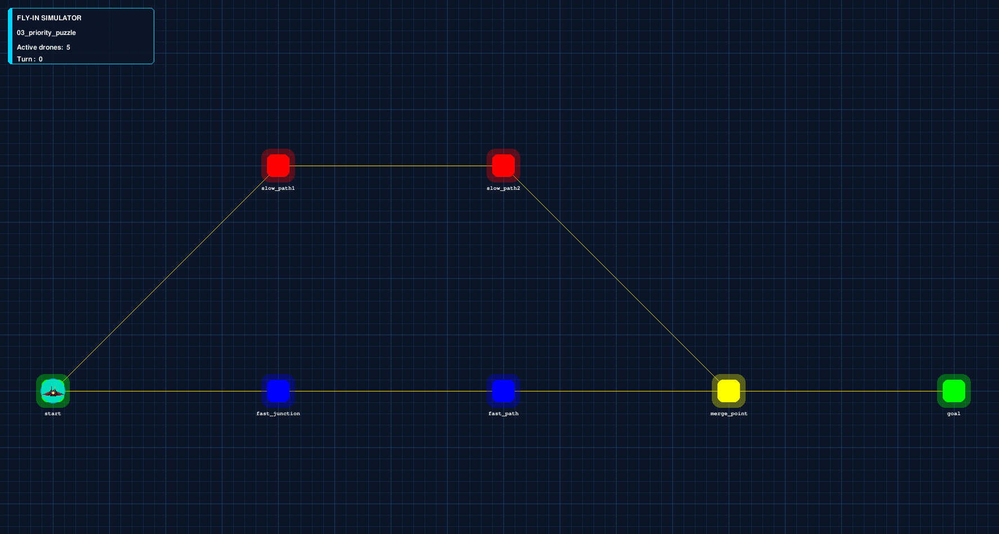

*This project has been created as part of the 42 curriculum by <tmattela>*

# FLY-IN

An optimized drone routing simulator built in Python with a graphical interface powered by Pygame. The goal of this project is to navigate a fleet of drones through a graph of connected hubs from a start point to an end point in the minimum number of turns while strictly adhering to hub and connection capacities.

---

## Description

**FLY-IN** is an algorithmic fleet management simulator accompanied by an interactive graphical visualizer. Developed in Python using Pygame, the application models and optimizes the real-time routing of a fleet of $N$ drones navigating through a constrained network of connected hubs.

### Goal
The main goal of the project is to safely route all drones from a starting location (`start_hub`) to a final destination (`end_hub`) in the **minimum possible number of turns**. The pathfinding and flow scheduler must strictly operate under complex real-world constraints, preventing collisions, deadlocks, link congestion, and hub capacity overflows.

### Overview & Constraints
The simulation operates on a weighted, capacity-constrained graph where:
- **Hubs (Nodes):** Represent physical positions with spatial coordinates $(x, y)$. Each hub can have an occupancy limit (`max_drones`) and specific zone classifications (`normal`, `priority`, `restricted`, or `blocked`) that affect traversal cost and accessibility.
- **Connections (Edges):** Link two hubs together with bandwidth restrictions (`max_link_capacity`), limiting how many drones can cross the connection simultaneously during a single turn.

The project features a full command-line menu for map selection, a robust parser with schema validation, a reverse weighted pathfinding algorithm, and a Pygame interface rendering real-time drone movements and metadata.

### Key Features
- **Interactive Map Browser:** Select map files easily through a terminal menu interface (`simple_term_menu`).
- **Robust Parsing & Validation:** Powered by `Pydantic` to ensure strict format verification, invalid character catching, and missing property detection.
- **Dynamic Pathfinding & Capacity Locking:** Uses a modified weighted Dijkstra algorithm combined with dynamic space reservation to maximize throughput per turn.
- **Graphical Interface (Pygame):** Displays real-time drone progression, zone color codes, HUD counters, and hover tooltips for hub status inspection.

## Instructions

### Prerequisites
- **Python:** Python 3.10+ installed on your system.
- **GNU Make:** Installed to run Makefile targets.

---

### Installation & Quick Start

The project includes a `Makefile` that handles virtual environment creation, dependency installation, and fetching official 42 test maps automatically.

To install dependencies and start the program immediately, run:
```bash
make run
```
#### Simulation Controls

When the graphical window is active, you can interact with the simulation using the following controls:

```
    SPACE: Advance the simulation by 1 turn (calculates and executes valid drone movements across the map).

    R: Reset the simulation back to Turn 0 (resets all drones to start_hub and restores initial capacity states).

    ESC (or closing the window): Exit the simulation application gracefully.

    Mouse Hover: Move your mouse cursor over any hub to inspect its real-time metadata (zone type, current occupancy, and maximum capacity) in the bottom status bar.
```


## Resources

### External References & Documentation
- **Pygame Documentation:** [pygame.org/docs](https://www.pygame.org/docs/) — Used for visual rendering, color management, and user interaction loops.
- **Pydantic Documentation:** [docs.pydantic.dev](https://docs.pydantic.dev/) — Reference for strict schema definitions, custom validators, and parsing error handling.
- **Dijkstra's Shortest Path Algorithm:** [GeeksforGeeks Guide](https://www.geeksforgeeks.org/dijkstras-shortest-path-algorithm-greedy-algo-7/) — Conceptual background for weighted shortest path computations and reverse distance graph implementation.
- **PEP 257 — Docstring Conventions:** [python.org/dev/peps/pep-0257](https://peps.python.org/pep-0257/) — Reference for Google-style Python documentation standard.

---

### AI Usage Disclosure

Artificial Intelligence (LLMs) was used during the development of this project strictly in accordance with 42 curriculum guidelines. AI assisted with the following specific tasks and components:

1. **Code Documentation & Typing:**
   - **Task:** Generating Google-style (PEP 257) Python docstrings and reviewing type hints (`mypy` compliance).
   - **Files affected:** `parser.py`, `dijkstra.py`, `map.py`, `menu.py`, `visualizer.py`, and `fly_in.py`.

2. **Parser Edge-Case Refinement:**
   - **Task:** Structuring Pydantic `@model_validator` logic to catch edge cases, such as rejecting zone names containing illegal characters (dashes `-`).
   - **Files affected:** `parser.py`.

3. **README Documentation:**
   - **Task:** Structuring, drafting, and refining the Markdown layout for this `README.md` file to satisfy all subject requirements.

## Algorithm Choices & Implementation Strategy

### 1. Reverse Weighted Dijkstra Algorithm
Rather than computing shortest paths independently for each drone, the program calculates a global distance lookup table starting from `end_hub` and traversing backward to all reachable hubs.

- **Weight Penalties by Zone:** Node traversal costs vary based on hub metadata:
  - `priority`: Weight = **3** (Fastest route incentive)
  - `normal`: Weight = **4** (Standard traversal cost)
  - `restricted`: Weight = **8** (Penalized route to avoid congestion)
  - `blocked`: Weight = **$\infty$** (Non-traversable node)
- **Reachability Verification (`can_reach_start_from`):** During Dijkstra graph exploration, neighbor links are accepted only if a valid path exists back to `start_hub` without traversing forbidden/blocked nodes. This eliminates dead-end graph segments.

### 2. Turn Scheduling & Dynamic Capacity Reservation
During each turn (triggered by pressing `SPACE`), candidate moves are evaluated for active drones:

1. **Neighbor Evaluation:** Active drones inspect adjacent connected hubs and prioritize choices that yield the minimum remaining distance to the goal (`distances[neighbor] + weight`).
2. **Capacity Validation:** A drone is allowed to move to a candidate hub if:
   $$\text{occupancy}(\text{target\_hub}) + \text{reserved}(\text{target\_hub}) < \text{max\_drones}(\text{target\_hub})$$
   $$\text{active\_connections}(\text{link}) < \text{max\_link\_capacity}(\text{link})$$
3. **Space Locking:** Approved movements increment `reserved_drones` on the target hub in real-time, preventing race conditions where multiple drones attempt to occupy the same limited capacity slot in a single turn.

---

## Visual Representation & UX Design

The Pygame visualizer (`visualizer.py`) converts abstract graph structures and capacity allocations into a clear graphical interface.

- **Dynamic Coordinate Auto-Scaling:** Automatically projects arbitrary map coordinate grids $(x, y)$ onto an $800 \times 600$ viewport using aspect-ratio preserving padding. Maps render clearly regardless of spatial dimensions.
- **Zone Color Coding & Visual Indicators:**
  - **Start / End Hubs:** Bold Cyan and Red markers.
  - **Priority Zones:** Bright Green outlines.
  - **Restricted Zones:** Yellow/Amber warnings.
  - **Blocked Zones:** Dark Red fill with distinct border treatments.
- **Hover Information HUD:** Hovering the mouse over any hub node updates a bottom status bar with real-time metadata (zone type, current occupancy, and maximum capacity limit).
- **Turn Progress Header:** A top HUD displays the current turn number, remaining drones at start, in-flight drones, and arrived drones.

---

## Example Input and Expected Output

### Input Map File (`maps/example_map.txt`)

```text
# Medium Level 3: Priority zones create optimal path challenges
nb_drones: 5

start_hub: start 0 0 [color=green]
hub: slow_path1 1 -1 [zone=restricted color=red]
hub: slow_path2 2 -1 [color=red]
hub: fast_junction 1 0 [zone=priority color=blue max_drones=2]
hub: fast_path 2 0 [zone=priority color=blue]
hub: merge_point 3 0 [color=yellow max_drones=3]
end_hub: goal 4 0 [color=green]

connection: start-slow_path1
connection: start-fast_junction
connection: slow_path1-slow_path2
connection: slow_path2-merge_point
connection: fast_junction-fast_path
connection: fast_path-merge_point
connection: merge_point-goal [max_link_capacity=2]
```
---




---

> [!NOTE]
> **Troubleshooting Map Downloads:**
> If `make install` fails with an `HTTP Error 404: Not Found` when executing the `wget` command, the CDN URL for `maps.tar.gz` in the `Makefile` may have expired or updated.
>
> **To fix this:**
> 1. Log in to the **42 Intra** and navigate to the **Fly-in** project page to obtain the updated URL for `maps.tar.gz`. Replace the URL on the following line in your `Makefile`:
>    ```makefile
>    $(PYTHON) -m wget <UPDATED_INTRA_URL>
>    ```
> 2. **Alternatively:** You can remove the `wget` line from the `Makefile` entirely:
>    ```makefile
>    # Remove or comment out this line:
>    # $(PYTHON) -m wget [https://cdn.intra.42.fr/document/document/57653/maps.tar.gz](https://cdn.intra.42.fr/document/document/57653/maps.tar.gz)
>    ```
>    Then, manually create a `maps/` directory in the repository root and place your `.txt` map files directly inside it.
